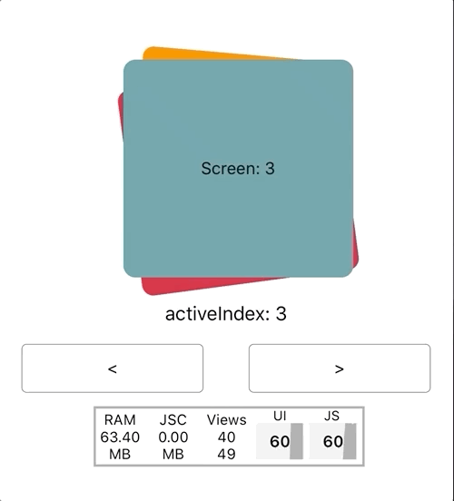
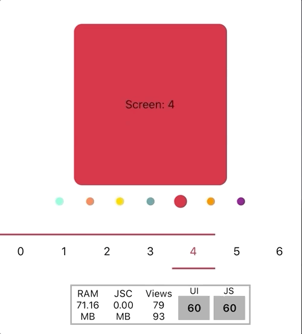

# react-native-pager

# Looking for maintainer(s)!

Unforunately I'm no longer able to keep up with this library - please reach out if anyone is interested in helping keep this up to date and give it some love! 

A fully controllable, high performance pager for React Native

<p align="center" style="display: flex; justify-content: center; align-items:center;">
  
   
</p>

# Installation

`yarn add @crowdlinker/react-native-pager`

If you're using expo, all dependencies are already installed by default. If not, you'll need to install two dependencies along with this library:

```bash
yarn add react-native-gesture-handler
yarn add react-native-reanimated
```

There are additional steps to setting these up:

- [react-native-gesture-handler](https://kmagiera.github.io/react-native-gesture-handler/docs/getting-started.html)
- [react-native-reanimated](https://github.com/kmagiera/react-native-reanimated#installation)

# Example

```javascript
// lots more examples are available in example/src directory of this repo

import React, { useState } from 'react';
import { View } from 'react-native';
import { Pager, PagerProvider } from '@crowdlinker/react-native-pager';
import { Slide } from './shared-components';

function MyPager() {
  const [activeIndex, onChange] = useState(1);

  return (
    <PagerProvider activeIndex={activeIndex} onChange={onChange}>
      <Pager>
        <Slide />
        <Slide />
        <Slide />
        <Slide />
      </Pager>
    </PagerProvider>
  );
}
```

# API Reference

## Pager

```typescript
import { Pager } from '@crowdlinker/react-native-pager'

Props
--------
children: React.ReactNode[];
activeIndex?: number; - active screen
onChange?: (nextIndex: number) => void; - active screen changed
initialIndex?: number; - initial active screen
springConfig?: Partial<SpringConfig> - configuration for spring transitions on swipe / snap
pageInterpolation?: iPageInterpolation - see below - configuration for individual page transforms
panProps?: Partial<GestureHandlerProperties> - configuration for <PanGestureHandler />
pageSize?: number; - percentage (0 - 1), how far should it page on index change
threshold?: number; - percentage (0 - 1), how far should the user drag before snapping to next / prev
minIndex?: number; - minimum index to swipe to (default 0)
maxIndex?: number; - maximum index to swipe to (default children.length - 1)
adjacentChildOffset?: number; - the number of children adjacent to the activeIndex to render
style?: ViewStyle; - style for pages
containerStyle?: ViewStyle - style for pan handler container
animatedValue?: Animated.Value<number>; - total translation value of the pager
animatedIndex?: Animated.Value<number>; - activeIndex as an animated value e.g intermediate values
type?: 'horizontal' | 'vertical'; - target horizontal swipes or vertical swipes
clamp?: {
  prev?: number; - percentage (0 - 1) - clamp children to the left of the active screen
  next?: number; - percentage (0 - 1) - clamp children to the right of the active screen
};
clampDrag: {
  prev?: number - max drag distance to previous screen,
  next?: number - max drag distance to next screen
}
```

This interface looks intimidating, but nearly all of these props are optional and customize specific behaviours. They won't be necessary in a lot of use cases.

## PagerProvider

```typescript
import { PagerProvider } from '@crowdlinker/react-native-pager'

Props
--------
children: React.ReactNode;
initialIndex?: number;
activeIndex?: number;
onChange?: (nextIndex: number) => void;
```

## Pagination

```typescript
import { Pagination } from '@crowdlinker/react-native-pager'

Props
--------
children: React.ReactNode;
pageInterpolation: iPageInterpolation;
style?: ViewStyle;
```

## Slider

```typescript
import { Slider } from '@crowdlinker/react-native-pager'

Props
--------
numberOfScreens: number;
style: ViewStyle;
```

## Progress

```typescript
import { Progress } from '@crowdlinker/react-native-pager'

Props
--------
numberOfScreens: number;
style: ViewStyle;
```

# Hooks

There are a number of useful hooks you can use in your screens when you wrap `<Pager />` in a `<PagerProvider />`

```typescript
  usePager(): [activeIndex, onChange, animatedIndex]
  useFocus(): boolean -> is screen focused
  useOffset(index: number) -> animatedIndex value relative to the given index
  useOnFocus(fn) -> fn() to fire on screen focus
  useIndex() -> the index of the screen
  useAnimatedIndex() -> the animatedIndex value of the pager
  useInterpolation(interpolationConfig) -> interpolated style object
```

### What is animatedIndex?

Animated index represents the animated value of the active index -- it includes possible intermediate values.
When panning or transitioning, the activeIndex value moves from 0 -> 1 but the animatedIndex value captures all intermediate values between 0 and 1 during this transition.

## Hooks in action

```javascript
function MySlide(props) {
  const [data, setData] = useState();

  useOnFocus(() => {
    if (!data) {
      myApi.fetchData(props);
    }
  });

  const style = useInterpolation({
    transform: [
      {
        scale: {
          inputRange: [-1, 0, 1],
          outputRange: [0.9, 1, 0.9],
          extrapolate: 'clamp',
        },
      },
      {
        rotate: {
          unit: 'deg',
          inputRange: [-1, 0, 1],
          outputRange: [90, 0, 120],
        },
      },
    ],
  });

  return <Animated.View style={{ flex: 1, ...style }}>...</Animated.View>;
}
```

# Interpolation

One of the core features of this library is the ability to customize style transformations based on a screen's position relative to the focused screen.

Here is an example of an interpolation configuration:

```javascript
const scaledDown = {
  transform: [
    {
      scaleX: {
        inputRange: [-1, 0, 1],
        outputRange: [0.8, 1, 0.8],
        extrapolate: 'clamp',
      },
    },
  ],
};
```

The object itself is the same shape as any `style` prop you would normally pass into a `<Animated.View />` component. However, the values of these properties define an interpolation configuration.

The input range refers to the position relative to the focused screen:

```javascript
inputRange: [-1, 0, 1];
// [-1] targets the screen before the focused screen
// [0] targets the screen that is focused
// [1] targets the screen after the focused screen
```

The output range reflects the style values that will be applied for each specified inputRange value:

```javascript
outputRange: [0.8, 1, 0.8];
// [0.8] will be applied to the screen before the focused screen
// [1] will be applied to the screen that is focused
// [0.8] will be applied to the screen after the focused screen
```

In this case, screens that are on the left and right of the focused screen will be scaled to 80% of their size, and any screen outside of this range will also be given 80% scale.

You can customize the behaviour of all of the screens in a `<Pager />` by passing this configuration as the `pageInterpolation` prop. The interpolations can target all kinds of style properties, such as translations, rotations, and more.

Alternatively, you can customize styles for individual screens by using the `useInterpolation()` hook. This accepts the same configuration object, and will return the style property that you can apply to your `Animated.View`

The interpolation configs can be found in the [`react-native-reanimated` docs here](https://github.com/kmagiera/react-native-reanimated#interpolate).

# Examples

All of the examples in the gifs above (and more) are available in the `/example/src` directory of this repo. For the most part, these are different configurations of the `pageInterpolation` prop. There is all kinds of neat stuff you can do with these - if you have a particular configuration you'd like to share, please submit a PR and spread the love!
