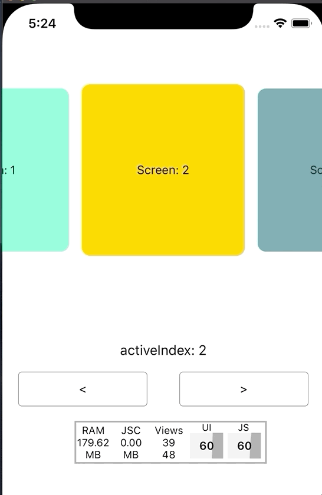
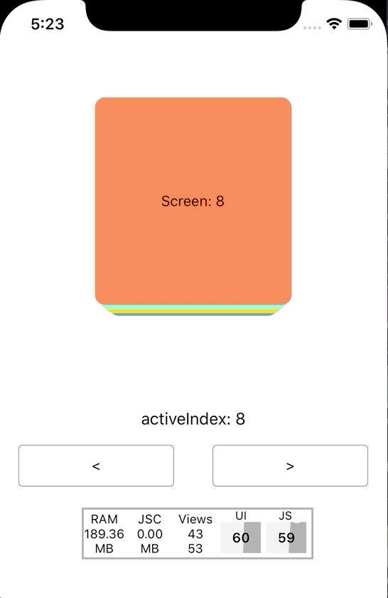
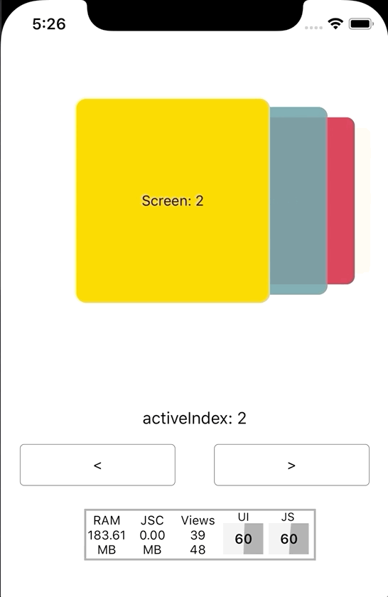
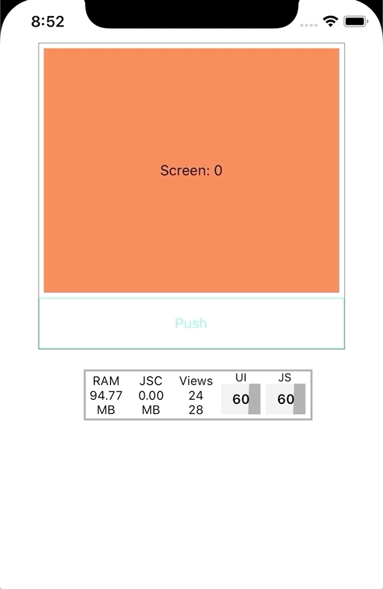
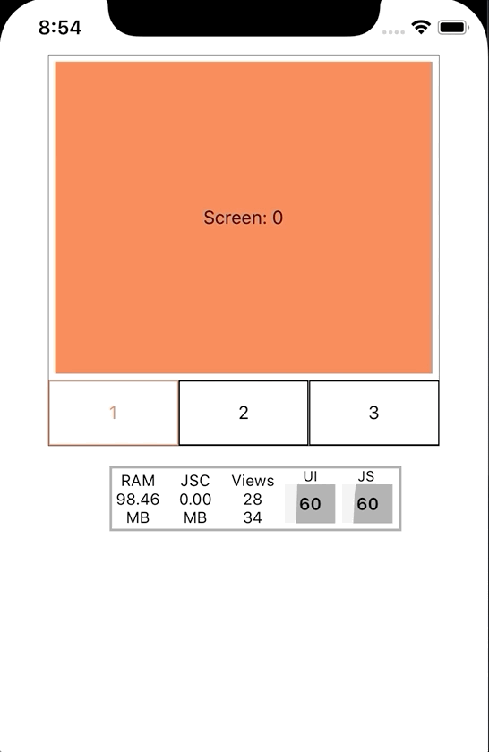

# react-native-pager

Fully controllable, high performance pager component w/ gesture support for React Native

<p align="center">
  
</p>

# Installation

`yarn add @crowdlinker/react-native-pager`

If you're using expo, all dependencies are already installed by default. If not, you'll need to install two dependencies along with this library:

```bash
yarn add react-native-gesture-handler
yarn add react-native-reanimated
```

There are additional steps to setting these up:

- [react-native-gesture-handler](https://kmagiera.github.io/react-native-gesture-handler/docs/getting-started.html)
- [react-native-reanimated](https://github.com/kmagiera/react-native-reanimated#installation)

# Examples

_These examples were inspired by the docs of the awesome [react-native-snap-carousel library](https://github.com/archriss/react-native-snap-carousel)_

<p align="center">
  
  
</p>

<p align="center">
  
  
</p>

### Basic Pager

```javascript
<Pager initialIndex={2}>
  <Screen />
  <Screen />
  <Screen />
  <Screen />
  <Screen />
</Pager>
```

### Controlled Pager

From App.js in /example directory

```javascript
// App.js
import React, { useState } from 'react';
import {
  SafeAreaView,
  StyleSheet,
  View,
  Text,
  Button,
  Alert,
  TouchableOpacity,
} from 'react-native';

console.disableYellowBox = true;

import { Pager } from '../src';

const colors = [
  'coral',
  'aquamarine',
  'gold',
  'cadetblue',
  'crimson',
  'darkorange',
  'darkmagenta',
  'salmon',
];

const screens = Array.from({ length: 10 }, (c, i) => (
  <View
    key={i}
    style={{
      flex: 1,
      justifyContent: 'center',
      alignItems: 'center',
      backgroundColor: colors[i % colors.length],
    }}
  >
    <Text>{`Screen: ${i}`}</Text>
    <Button title="Hello" onPress={() => Alert.alert('Joe')} />
  </View>
));

const App = () => {
  const [activeIndex, onChange] = useState(0);

  return (
    <SafeAreaView style={{ flex: 1 }}>
      <Pager
        activeIndex={activeIndex}
        onChange={onChange}
        adjacentChildOffset={2}
      >
        {screens}
      </Pager>

      <Buttons activeIndex={activeIndex} setActiveIndex={onChange} />
    </SafeAreaView>
  );
};

function Buttons({ activeIndex, onChange }) {
  return (
    <View style={{ height: 75, width: '100%' }}>
      <Text
        style={{
          fontSize: 16,
          height: 25,
          textAlign: 'center',
        }}
      >{`activeIndex: ${activeIndex}`}</Text>

      <View style={{ flex: 1, flexDirection: 'row' }}>
        <TouchableOpacity
          title="Dec"
          style={{
            flex: 1,
            borderWidth: StyleSheet.hairlineWidth,
            borderRadius: 4,
            alignItems: 'center',
            justifyContent: 'center',
          }}
          onPress={() => onChange(activeIndex - 1)}
        >
          <Text>{`<`}</Text>
        </TouchableOpacity>

        <TouchableOpacity
          style={{
            flex: 1,
            borderWidth: StyleSheet.hairlineWidth,
            borderRadius: 4,
            alignItems: 'center',
            justifyContent: 'center',
          }}
          onPress={() => onChange(activeIndex + 1)}
        >
          <Text>{`>`}</Text>
        </TouchableOpacity>
      </View>
    </View>
  );
}
```

# API Reference

## Pager

```typescript
import { Pager } from 'react-native-pager-component'

Props
--------
activeIndex?: number; - active screen
onChange?: (nextIndex: number) => void; - active screen changed
initialIndex?: number; - initial active screen
children: React.ReactNode[];
springConfig?: Partial<SpringConfig> - configuration for spring transitions on swipe / snap
pageInterpolation?: ViewStyle - see below - configuration for individual page transforms
panProps?: Partial<GestureHandlerProperties> - configuration for <PanGestureHandler />
pageSize?: number; - percentage (0 - 1), how far should it page on index change
threshold?: number; - percentage (0 - 1), how far should the user drag before snapping to next / prev
minIndex?: number; - minimum index to swipe to (default 0)
maxIndex?: number; - maximum index to swipe to (default children.length - 1)
adjacentChildOffset?: number; - the number of children adjacent to the activeIndex to render
style?: ViewStyle; - container style for the pager
animatedValue?: Animated.Value<number>; - total translation value of the pager
type?: 'horizontal' | 'vertical'; - target horizontal swipes or vertical swipes
clamp?: {
  prev?: number; - percentage (0 - 1) - clamp children to the left of the active screen
  next?: number; - percentage (0 - 1) - clamp children to the right of the active screen
};
clampDrag: {
  prev?: number - max drag distance to previous screen,
  next?: number - max drag distance to next screen
}
```

## Tabs and Stack

Tab and Stack configurations are pretty straightforward to get setup:

<p align="center">
  
</p>

```javascript
const stackInterpolation = {
  zIndex: offset => offset,

  transform: [
    {
      scale: {
        inputRange: [-1, 0, 1],
        outputRange: [0.95, 1, 0.95],
      },
    },
  ],
};

function Stack({ children }) {
  const [activeIndex, setActiveIndex] = useState(0);

  return (
    <View style={{ flex: 1, borderWidth: StyleSheet.hairlineWidth }}>
      <Pager
        pageInterpolation={stackInterpolation}
        activeIndex={activeIndex}
        onChange={setActiveIndex}
        clamp={{ prev: 0.3 }}
        clampDrag={{ next: 0 }}
        style={{ flex: 1, overflow: 'hidden', paddingVertical: 5 }}
      >
        {children}
      </Pager>

      <View style={{ height: 50, flexDirection: 'row' }}>
        <TouchableOpacity
          onPress={() =>
            setActiveIndex(Math.min(activeIndex + 1, children.length - 1))
          }
          style={{
            flex: 1,
            justifyContent: 'center',
            alignItems: 'center',
            borderWidth: 1,
            borderColor: colors[activeIndex],
          }}
        >
          <Text style={{ color: colors[activeIndex] }}>Push</Text>
        </TouchableOpacity>
      </View>
    </View>
  );
}
```

<p align="center">
  
</p>

```javascript
function Tabs({ children }) {
  const [activeIndex, setActiveIndex] = useState(0);

  return (
    <View style={{ flex: 1, borderWidth: StyleSheet.hairlineWidth }}>
      <Pager
        activeIndex={activeIndex}
        onChange={setActiveIndex}
        style={{ flex: 1, overflow: 'hidden', paddingVertical: 5 }}
      >
        {children}
      </Pager>

      <View style={{ height: 50, flexDirection: 'row' }}>
        {React.Children.map(children, (c, i) => (
          <TouchableOpacity
            onPress={() => setActiveIndex(i)}
            style={{
              flex: 1,
              justifyContent: 'center',
              alignItems: 'center',
              borderWidth: 1,
              borderColor: activeIndex === i ? colors[i] : 'black',
            }}
          >
            <Text style={{ color: activeIndex === i ? colors[i] : 'black' }}>
              {i + 1}
            </Text>
          </TouchableOpacity>
        ))}
      </View>
    </View>
  );
}
```

## Customization

The default settings for the pager component will be a full screen page that handles horizontal swipes.

You can customize the behaviour of individual cards using the `pageInterpolation` prop. It accepts an object of interpolation configurations for the different properties you want to transform. The interpolation configs can be found in the [`react-native-reanimated` docs here](https://github.com/kmagiera/react-native-reanimated#interpolate).

There's some pretty neat stuff you can do with these -- here are some examples for the configs above:

<p align="center">
  
</p>

```javascript
// the numbers we are interpolating are relative to the active card
// e.g an inputRange value of -1 means it is 1 page to the left of whatever is active.

const kilterCards = {
  transform: [
    {
      scale: {
        inputRange: [-1, 0, 1],
        outputRange: [0.95, 1, 0.95],
      },
    },

    {
      translateY: {
        inputRange: [-1, 0, 1, 2],
        outputRange: [0, 0, 10, -15],
      },
    },

    {
      rotate: {
        unit: 'deg',
        inputRange: [-1, 0, 1, 2],
        outputRange: [-20, 0, -7.5, 5],
      },
    },
  ],

  opacity: {
    inputRange: [-1, 0, 1, 2, 3],
    outputRange: [0, 1, 1, 1, 0],
  },
};

<Pager clamp={{ next: 0 }} pageInterpolation={kilterCards}>
  ...
</Pager>;
```

<p align="center">
  
</p>

```javascript
const swipeCards = {
  transform: [
    {
      scale: {
        inputRange: [-1, 0, 1],
        outputRange: [0.95, 1, 0.95],
        clamp: Extrapolate.EXTEND,
      },
    },
    {
      translateX: {
        inputRange: [-1, 0, 1],
        outputRange: [-150, 0, 0],
      },
    },
    {
      // you can pass a function as a transformer -- offset in this case will represent
      // the distance a screen is from the active screen
      // e.g -1 means 1 to the left, 4 means 4 to the right
      translateY: (offset: Animated.Value<number>) =>
        Animated.multiply(offset, 10),
    },
    {
      rotate: {
        unit: 'deg',
        inputRange: [-1, 0, 1],
        outputRange: [-20, 0, 0],
        clamp: Extrapolate.EXTEND,
      },
    },
  ],

  // any Animated[fn] can be used in these functions
  zIndex: offset => floor(divide(offset, -1)),
};

<Pager clamp={{ next: 0 }} pageInterpolation={swipeCards}>
  ...
</Pager>;
```
