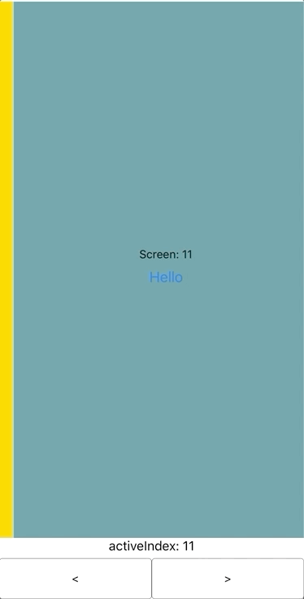

# react-native-pager

Controllable pager component w/ gesture support for React Native

<p align="center">
  
</p>

# Installation

`yarn add @crowdlinker/react-native-pager`

If you're using expo, all dependencies are already installed by default. If not, you'll need to install two dependencies along with this library:

```
yarn add react-native-gesture-handler
yarn add react-native-reanimated
```

There are additional steps to setting these up:

- [react-native-gesture-handler](https://kmagiera.github.io/react-native-gesture-handler/docs/getting-started.html)
- [react-native-reanimated](https://github.com/kmagiera/react-native-reanimated#installation)

# Example

From App.js in /example directory

```
// App.js
import React, {useState} from 'react';
import {
  SafeAreaView,
  StyleSheet,
  View,
  Text,
  Button,
  Alert,
  TouchableOpacity,
} from 'react-native';

console.disableYellowBox = true;

import {Pager} from '../src';

const colors = [
  'coral',
  'aquamarine',
  'gold',
  'cadetblue',
  'crimson',
  'darkorange',
  'darkmagenta',
  'salmon',
];

const App = () => {
  const [activeIndex, setActiveIndex] = useState(0);

  const children = Array.from({length: activeIndex + 2}, (c, i) => (
    <View
      key={i}
      style={{
        flex: 1,
        justifyContent: 'center',
        alignItems: 'center',
        backgroundColor: colors[i % colors.length],
      }}>
      <Text>{`Screen: ${i}`}</Text>
      <Button title="Hello" onPress={() => Alert.alert('Joe')} />
    </View>
  ));

  return (
    <SafeAreaView style={{flex: 1}}>
      <Pager
        activeIndex={activeIndex}
        onChange={setActiveIndex}
        adjacentChildOffset={2}>
        {children}
      </Pager>

      <Buttons activeIndex={activeIndex} setActiveIndex={setActiveIndex} />
    </SafeAreaView>
  );
};

function Buttons({activeIndex, setActiveIndex}) {
  return (
    <View style={{height: 75, width: '100%'}}>
      <Text
        style={{
          fontSize: 16,
          height: 25,
          textAlign: 'center',
        }}>{`activeIndex: ${activeIndex}`}</Text>

      <View style={{flex: 1, flexDirection: 'row'}}>
        <TouchableOpacity
          title="Dec"
          style={{
            flex: 1,
            borderWidth: StyleSheet.hairlineWidth,
            borderRadius: 4,
            alignItems: 'center',
            justifyContent: 'center',
          }}
          onPress={() => setActiveIndex(activeIndex - 1)}>
          <Text>{`<`}</Text>
        </TouchableOpacity>

        <TouchableOpacity
          style={{
            flex: 1,
            borderWidth: StyleSheet.hairlineWidth,
            borderRadius: 4,
            alignItems: 'center',
            justifyContent: 'center',
          }}
          onPress={() => setActiveIndex(activeIndex + 1)}>
          <Text>{`>`}</Text>
        </TouchableOpacity>
      </View>
    </View>
  );
}
```

# API Reference

## Pager

```
import { Pager } from 'react-native-pager-component'

Props
--------
activeIndex?: number;
onChange?: (nextIndex: number) => void;
initialIndex?: number;
children: React.ReactNode[];
springConfig?: any;
panProps?: Partial<GestureHandlerProperties>;
pageSize?: number;
threshold?: number;
minIndex?: number;
maxIndex?: number;
adjacentChildOffset?: number;
style?: any;
animatedValue?: Animated.Value<number>;
type?: 'horizontal' | 'vertical';
clamp?: {
  prev?: number;
  next?: number;
};
clampDrag?: {
  prev?: number;
  next?: number;
};
```
